# 🛡️ Mini SOC — Active Directory Attack Detection with Wazuh


---

## 📋 Project Overview

This project simulates a **real-world SOC (Security Operations Center)** environment built entirely in a home lab using VirtualBox. The goal was to deploy a functional SIEM, simulate multi-stage Active Directory attacks, and validate detection capabilities — mirroring the day-to-day workflow of a **SOC L1/L2 Analyst**.

The environment covers the full attack lifecycle: from initial reconnaissance through credential access, with every phase detected and alerted on by **Wazuh SIEM**, mapped to **MITRE ATT&CK** techniques, and documented in a formal **Incident Report**.

---

## 🗺️ Lab Architecture

```
┌─────────────────────────────────────────────────────────────────┐
│                        VirtualBox Host                          │
│                                                                 │
│  ┌──────────────────┐        ┌──────────────────────────────┐  │
│  │   Kali Linux     │        │     Ubuntu Server 22.04      │  │
│  │  192.168.10.4    │        │       192.168.10.3           │  │
│  │                  │        │                              │  │
│  │  • Impacket      │        │  • Wazuh Manager 4.10        │  │
│  │  • CrackMapExec  │        │  • Wazuh Indexer             │  │
│  │  • Atomic Red    │        │  • Wazuh Dashboard           │  │
│  │    Team          │        │    (OpenSearch)              │  │
│  └────────┬─────────┘        └──────────────────────────────┘  │
│           │                             ▲  ▲                   │
│           │  Attack Traffic             │  │ Agent Logs         │
│           ▼                             │  │                    │
│  ┌──────────────────────────────────────┴──┴────────────────┐  │
│  │               Internal Network — 192.168.10.0/24         │  │
│  └──────────────────────────────────────────────────────────┘  │
│           │                                      │              │
│           ▼                                      ▼              │
│  ┌──────────────────┐                ┌──────────────────────┐  │
│  │ Windows Server   │                │    Windows 10        │  │
│  │   2022 (DC01)    │                │     (WIN10)          │  │
│  │  192.168.10.1    │                │   192.168.10.2       │  │
│  │                  │                │                      │  │
│  │  • Active Dir.   │◄───Domain──────│  • Domain Member     │  │
│  │  • DNS           │                │  • Wazuh Agent       │  │
│  │  • Wazuh Agent   │                │                      │  │
│  └──────────────────┘                └──────────────────────┘  │
└─────────────────────────────────────────────────────────────────┘

Domain: homelab.local
Users:  administrator | Admin | jan.kowalski | piotr.wisniewski | anna.nowak
SVC:    sqlsvc (Kerberoasting target — SPN: MSSQLSvc/dc01.homelab.local:1443)
```

---

## 🧰 Technologies Used

| Category | Tool / Technology |
|----------|------------------|
| SIEM | Wazuh 4.10 (Manager + Indexer + Dashboard) |
| Operating Systems | Windows Server 2022, Windows 10, Ubuntu Server, Kali Linux |
| Identity & Access | Active Directory Domain Services (AD DS), DNS |
| Attack Tools | Impacket, CrackMapExec, Atomic Red Team, Hashcat |
| Detection | Custom Wazuh Rules, MITRE ATT&CK Mapping |
| Virtualization | VirtualBox |
| Reporting | OpenSearch Dashboards, PDF Incident Report |

---

## ⚔️ Attack Phases & Detection

### Phase 1 — SIEM Integration & Agent Deployment

Wazuh agents were deployed on both Windows machines (DC01 and WIN10) and connected to the central Wazuh Manager. Baseline event collection was verified by confirming the appearance of Windows Security Event IDs in the dashboard.

**Event IDs monitored at this stage:**
- `4624` — Logon Success
- `4625` — Logon Failure
- `4688` — Process Creation

**Screenshot — 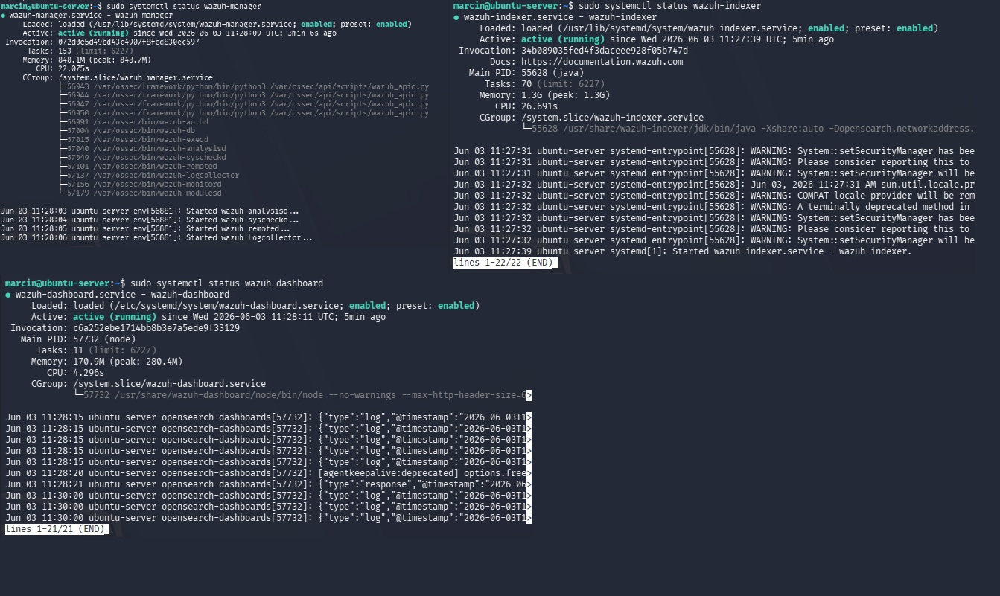
> Terminal output on Ubuntu Server showing all three Wazuh components (`wazuh-manager`, `wazuh-indexer`, `wazuh-dashboard`) in `active (running)` state — confirming successful deployment.

**Screenshot — 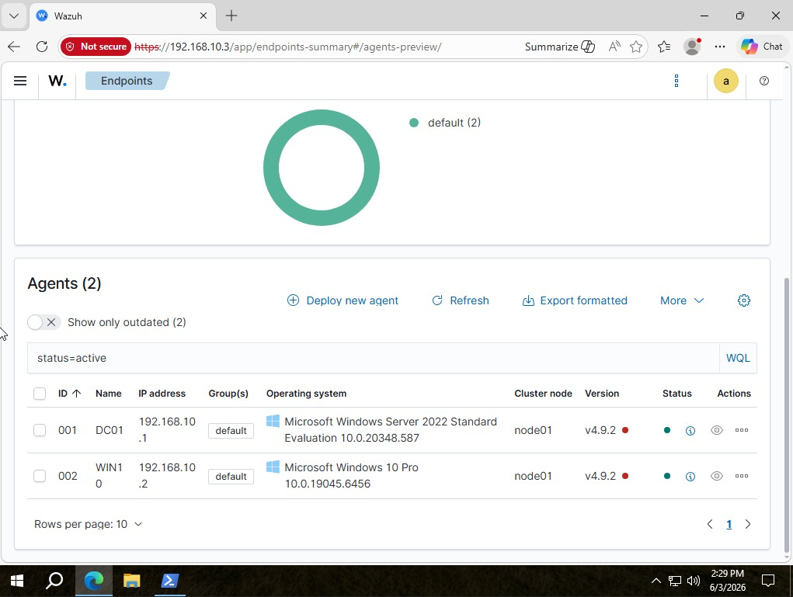
> Wazuh Dashboard home page after first login showing both agents (DC01 and WIN10) connected and actively forwarding logs.

---

### Phase 2 — Password Spraying `T1110`

A password spraying attack was launched from Kali Linux (192.168.10.4) against all domain user accounts. Unlike brute force, password spraying uses a single common password across many accounts to avoid triggering lockout policies.

**MITRE ATT&CK:** [T1110 — Brute Force](https://attack.mitre.org/techniques/T1110/)

**Screenshot — 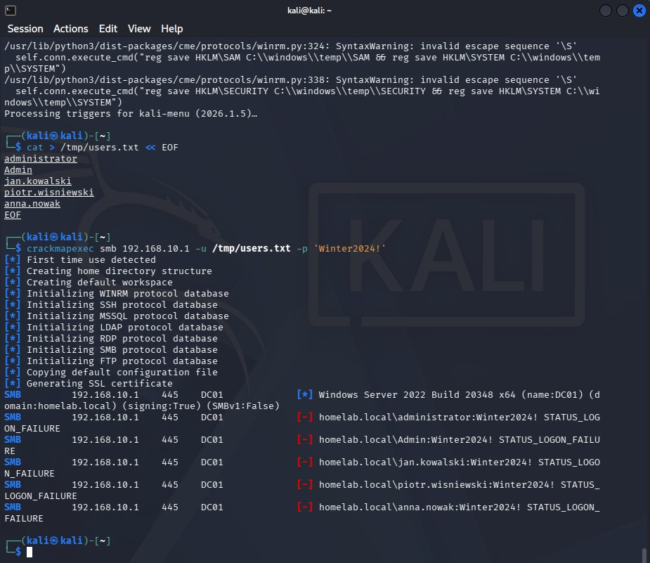**
> Kali Linux terminal showing CrackMapExec executing a spray against the domain — multiple `[-]` failures visible for each user account, generating Event ID 4625 on the Domain Controller.

**Screenshot — 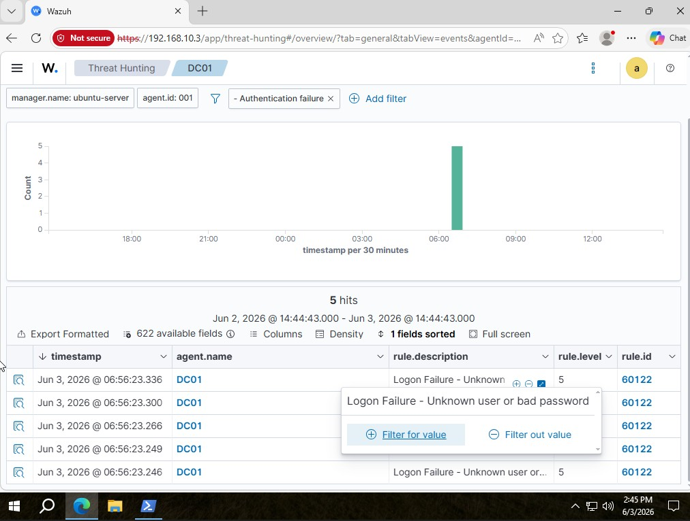**
> Wazuh Security Events view filtered to show a spike of Event ID 4625 (Logon Failure) events — all sourced from attacker IP 192.168.10.4 within a short timeframe, triggering custom rule 100002 (Multiple Failed Logon Attempts).

---

### Phase 3 — PowerShell Abuse `T1059.001`

PowerShell was used on the WIN10 workstation to perform internal reconnaissance. Commands were executed to enumerate running processes, local users, and system information — simulating an attacker's post-compromise discovery phase.

**MITRE ATT&CK:** [T1059.001 — PowerShell](https://attack.mitre.org/techniques/T1059/001/)

**Commands executed:**
```powershell
Get-Process
Get-LocalUser
Get-ComputerInfo
```

**Screenshot — 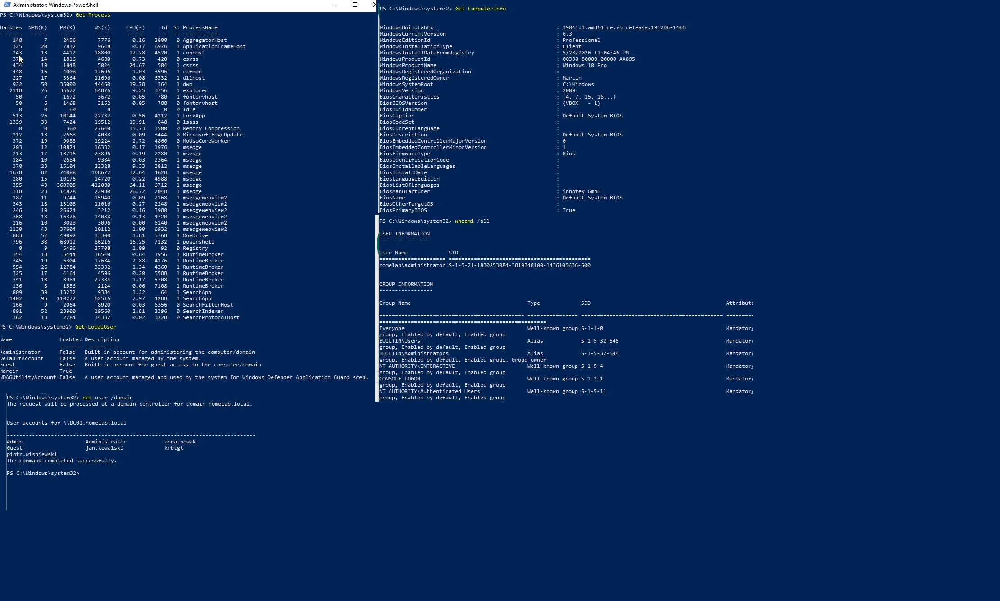**
> PowerShell terminal on WIN10 showing the execution of recon commands. Event ID 4688 (Process Creation) was generated for each command, captured by the Wazuh agent and forwarded to SIEM.

**Screenshot — 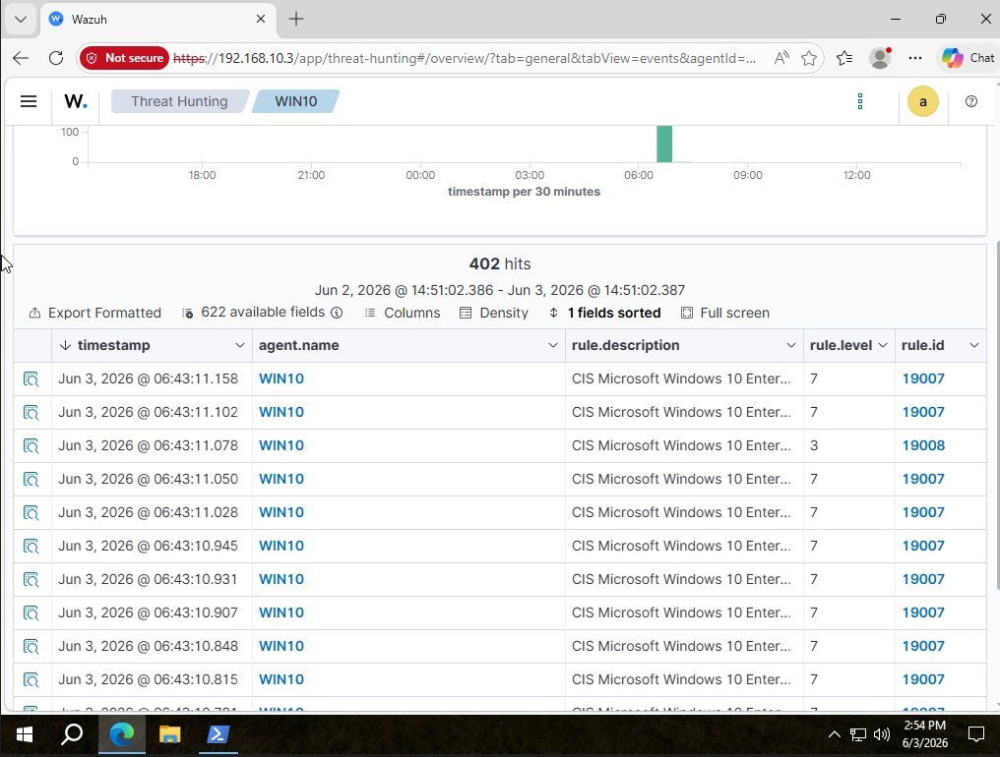**
> Wazuh alert dashboard showing custom rule 100001 firing — "Suspicious PowerShell Execution Detected" — with the full command-line visible in the event details.

---

### Phase 4 — Atomic Red Team Simulation `T1059.001` / `T1003`

Atomic Red Team was used to simulate additional adversary techniques in a controlled and repeatable way. Tests were executed directly on WIN10 to generate realistic telemetry without deploying actual malware.

**Tests executed:**
```powershell
Invoke-AtomicTest T1059.001
Invoke-AtomicTest T1003
```

**Screenshot — 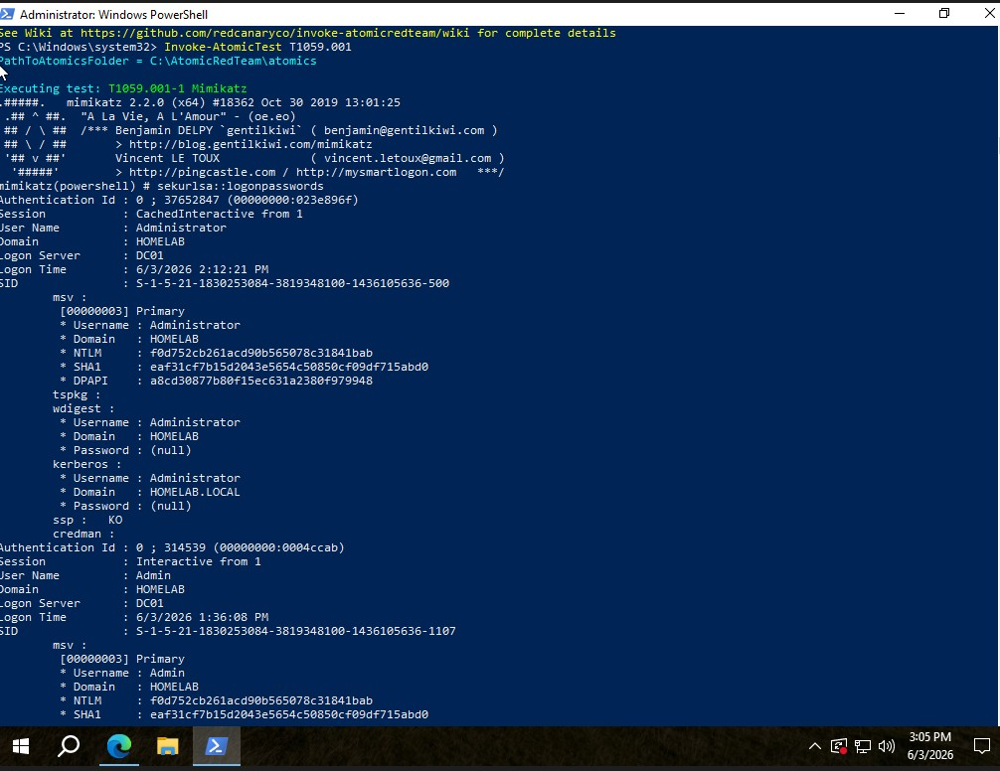**
> PowerShell terminal on WIN10 showing Atomic Red Team test execution output — each test generates specific Windows event log entries that Wazuh captures and maps to MITRE ATT&CK techniques.

---

### Phase 5 — Kerberoasting `T1558.003` ⭐

The most impactful phase. A service account (`sqlsvc`) was configured with an SPN in Active Directory. The attacker then requested a Kerberos Service Ticket for that account — receiving an RC4-encrypted TGS hash that was cracked offline.

**MITRE ATT&CK:** [T1558.003 — Kerberoasting](https://attack.mitre.org/techniques/T1558/003/)

**Attack command on Kali Linux:**
```bash
impacket-GetUserSPNs homelab.local/admin -dc-ip 192.168.10.1 -request
```

**Result:** `$krb5tgs$23$*sqlsvc$HOMELAB.LOCAL$...` hash obtained and cracked with Hashcat.

**Screenshot — 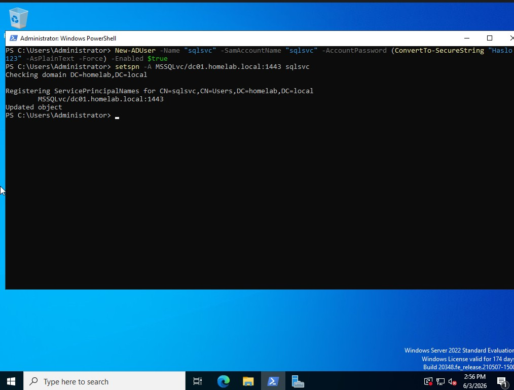**
> PowerShell on DC01 confirming SPN registration for the `sqlsvc` service account using `setspn -L sqlsvc`. This is the prerequisite for a Kerberoasting attack.

**Screenshot — 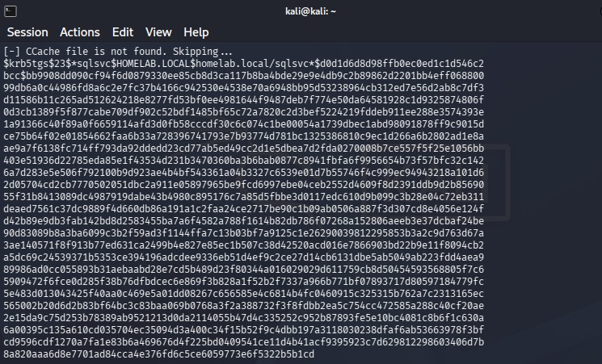**
> Kali Linux terminal showing Impacket's GetUserSPNs output — `sqlsvc` account discovered with SPN, and the full `$krb5tgs$23$` hash returned. This hash represents a stolen Kerberos service ticket.

**Screenshot — 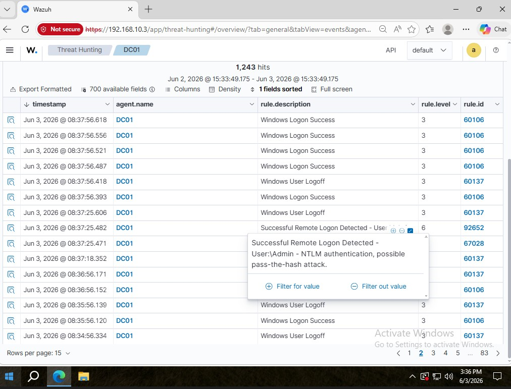**
> Wazuh Security Events showing Event,showing the RC4 hash being cracked and ID 4769 (Kerberos Service Ticket Requested) with RC4 encryption type (0x17) — triggering custom rule 100003 "Possible Kerberoasting Attack".

---

## 🔧 Custom Detection Rules

Three custom rules were written and deployed in `/var/ossec/etc/rules/local_rules.xml` to enhance detection beyond the default Wazuh ruleset:

```xml
<group name="windows,security,custom">

  <!-- Rule 1: Suspicious PowerShell Execution -->
  <rule id="100001" level="10">
    <if_group>windows</if_group>
    <field name="win.eventdata.commandLine" type="pcre2">(?i)powershell</field>
    <description>Suspicious PowerShell Execution Detected</description>
    <mitre>
      <id>T1059.001</id>
    </mitre>
  </rule>

  <!-- Rule 2: Multiple Failed Logons *Brute Force) -->
  <rule id="100002" level="12" frequency="5" timeframe="60">
    <if_matched_sid>60122</if_matched_sid>
    <description>Multiple Failed Logon Attempts - Possible Brute Force</description>
    <mitre>
      <id>T1110</id>
    </mitre>
  </rule>

  <!-- Rule 3: Kerberoasting Detection -->
  <rule id="100003" level="14">
    <if_group>windows</if_group>
    <field name="win.system.eventID">^4769$</field>
    <field name="win.eventdata.ticketEncryptionType">^0x17$</field>
    <description>Possible Kerberoasting Attack - RC4 Ticket Requested</description>
    <mitre>
      <id>T1558.003</id>
    </mitre>
  </rule>

</group>
```

**Screenshot —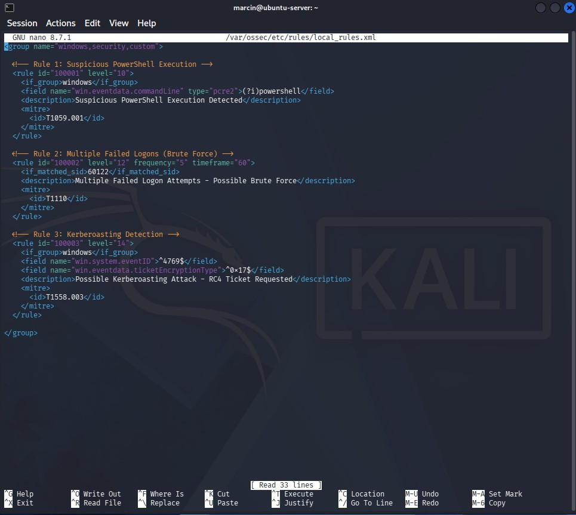**
> nano editor on Ubuntu Server showing the `local_rules.xml` file with all three custom rules — demonstrating the ability to write and deploy custom SIEM detection logic beyond out-of-the-box capabilities.

---

## 📊 MITRE ATT&CK Coverage

| Technique ID | Technique Name | Tactic | Severity | Detected by Wazuh |
|---|---|---|---|---|
| T1110 | Brute Force / Password Spraying | Credential Access | 🟠 HIGH | ✅ Rule 100002 |
| T1059.001 | PowerShell | Execution | 🟡 MEDIUM | ✅ Rule 100001 |
| T1003 | OS Credential Dumping | Credential Access | 🟠 HIGH | ✅ Default + Atomic |
| T1558.003 | Kerberoasting | Credential Access | 🔴 CRITICAL | ✅ Rule 100003 |

---

## 📈 Dashboard

A custom OpenSearch dashboard was built to provide visual insight into the security events collected during the exercise.

**Panels included:**
- Failed Logins Over Time (bar chart)
- Top Targeted Users (pie chart)
- MITRE ATT&CK Techniques (data table)
- Alert Severity Levels (bar chart)

**Screenshot — 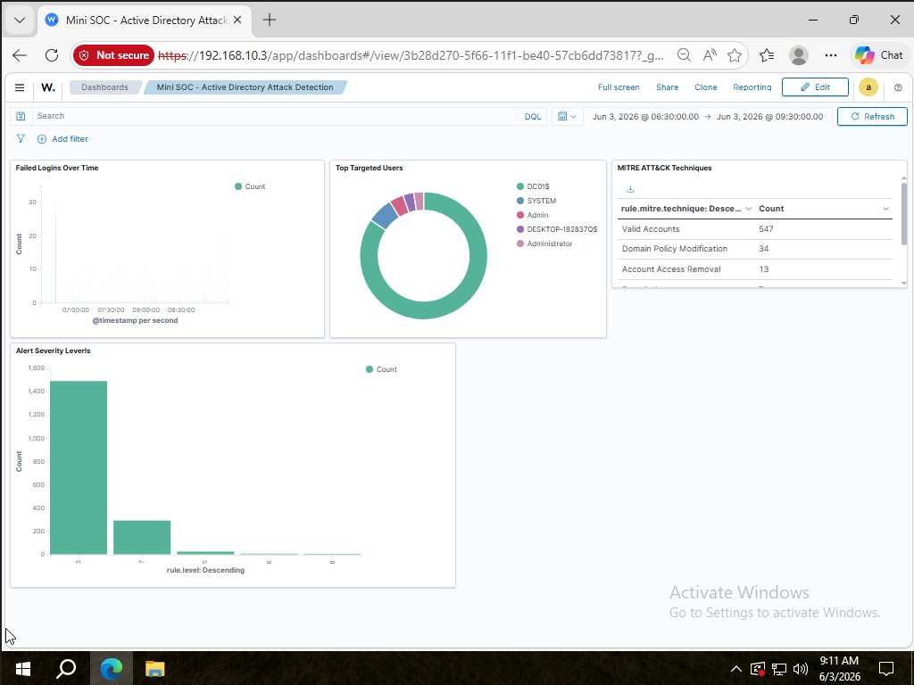**
> Full Wazuh OpenSearch dashboard showing all four panels populated with data from the attack simulation — providing an at-a-glance view of the security posture across the homelab.local environment.

---

## 📄 Incident Report

A formal incident report was produced documenting the full attack scenario, timeline, IOCs, MITRE ATT&CK mapping, and remediation recommendations — as would be expected from a SOC analyst after investigating a real security incident.

📎 [View Incident Report PDF](./Incident-Report/Incident-Report.pdf)

**Key sections:**
- Executive Summary
- Environment Overview
- Attack Timeline
- Detailed Attack Analysis per Phase
- Indicators of Compromise (IOC)
- MITRE ATT&CK Mapping
- Custom Detection Rules
- Recommendations
- Conclusion

---

## 🔑 Key Takeaways

- **Kerberoasting is silent without proper monitoring** — Event ID 4769 with RC4 (0x17) is the tell-tale sign, but only if you're collecting and analysing Kerberos ticket events.
- **Service accounts with weak passwords are a critical risk** — even with a strong-looking hash, offline cracking with a wordlist is fast and effective.
- **Custom SIEM rules matter** — out-of-the-box Wazuh won't catch everything. Writing targeted rules for your environment significantly improves detection fidelity.
- **MITRE ATT&CK is the common language of threat detection** — mapping every alert to a technique ID enables faster triage and better communication between SOC tiers.

---

## 📁 Repository Structure

```
Mini-SOC-Wazuh-Active-Directory/
├── README.md
├── Screenshots/
│   ├── ss1.jpg
│   ├── ss5.jpg
│   ├── ss8.jpg
│   ├── ss9.jpg
│   ├── ss10.jpg
│   ├── ss11.jpg
│   ├── ss13.jpg
│   ├── ss15.jpg
│   ├── ss16.jpg
│   ├── ss17.jpg
│   ├── ss19.jpg
│   └── ss20.jpg
├── Detection-Rules/
│   └── local_rules.xml
└── Incident-Report/
    └── Incident-Report.pdf
```

---

*Built as part of a home lab portfolio to demonstrate practical SOC analyst skills including SIEM deployment, Active Directory administration, threat simulation, and incident response.*
