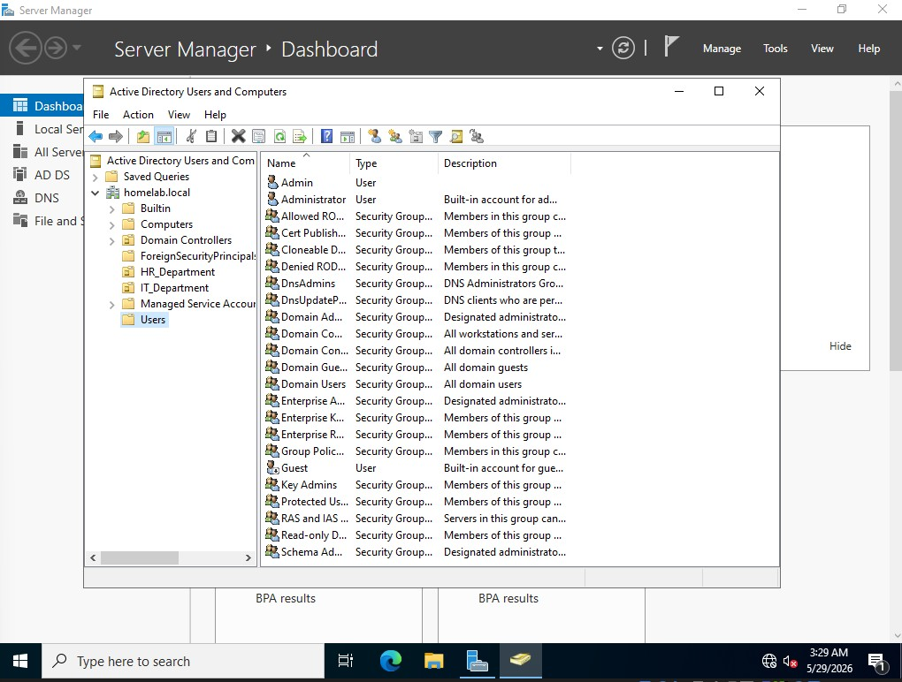
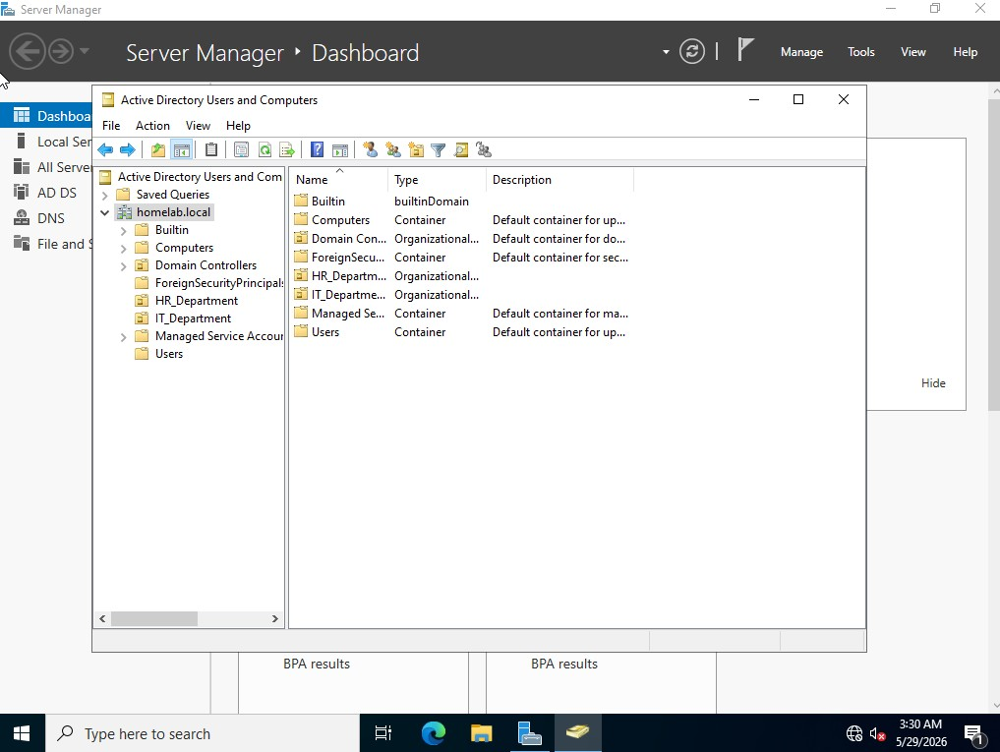
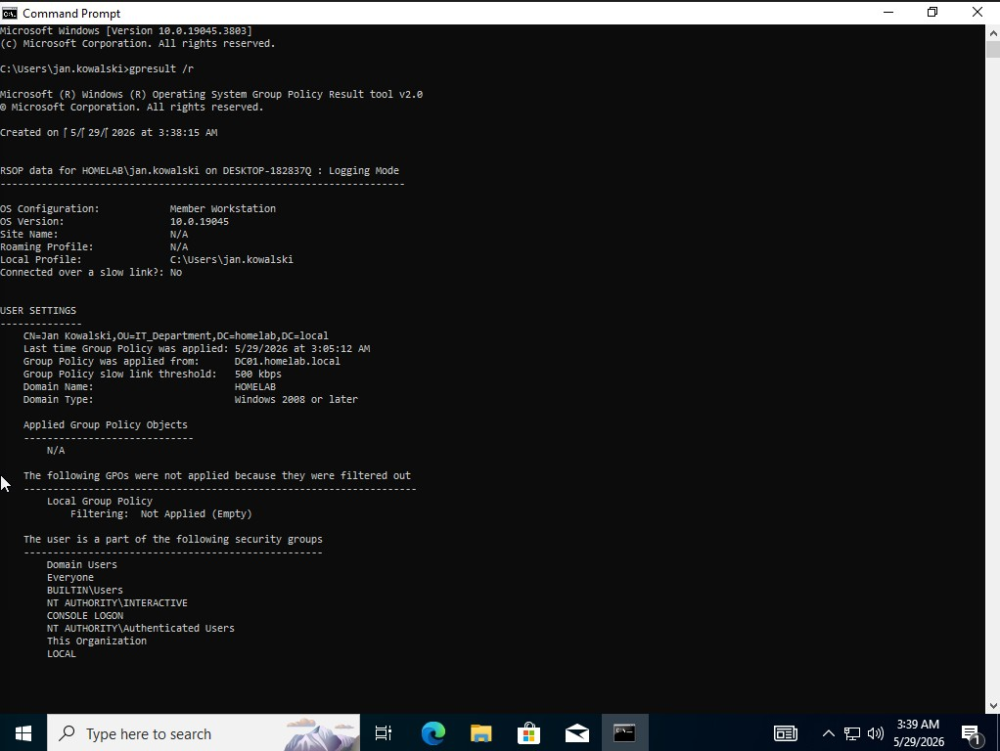
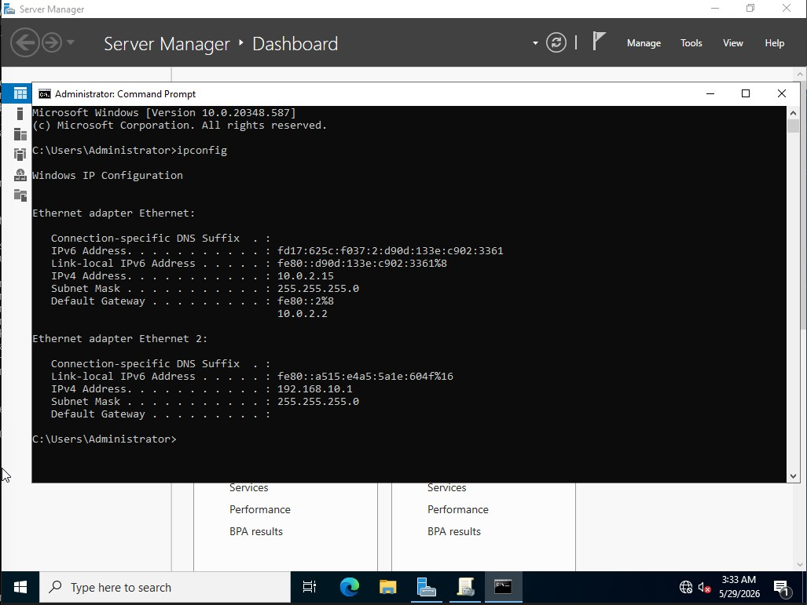
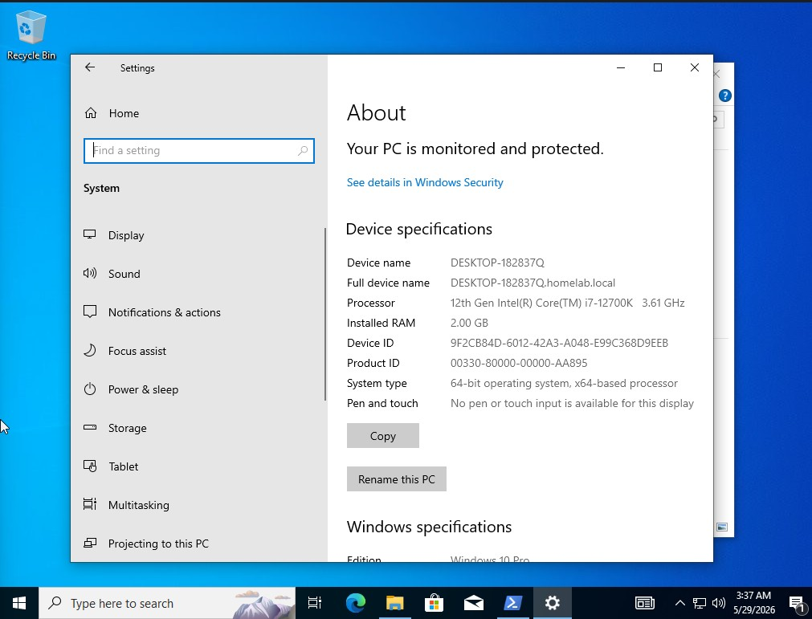

# Active Directory Configuration

## Overview
Deployed Active Directory Domain Services on Windows Server 2022.

## Domain
- Domain name: homelab.local
- Domain Controller: DC01 (192.168.10.1)

## Organizational Units
- IT_Department
- HR_Department

## Users Created
- jan.kowalski (IT_Department)
- anna.nowak (HR_Department)
- piotr.wisniewski (IT_Department)

## Group Policy Objects
- IT_Security_Policy applied to IT_Department
  - Minimum password length: 8 characters
  - Password complexity: Enabled

## Screenshots

*Active Directory users created in homelab.local domain*

*Organizational Units — IT_Department and HR_Department*

*IT_Security_Policy GPO linked to IT_Department*

*Windows Server 2022 static IP configuration — 192.168.10.1*

*Windows 10 joined to homelab.local domain*

*GPO successfully applied on domain client — verified with gpresult*
