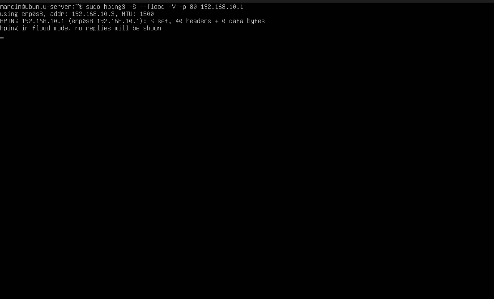
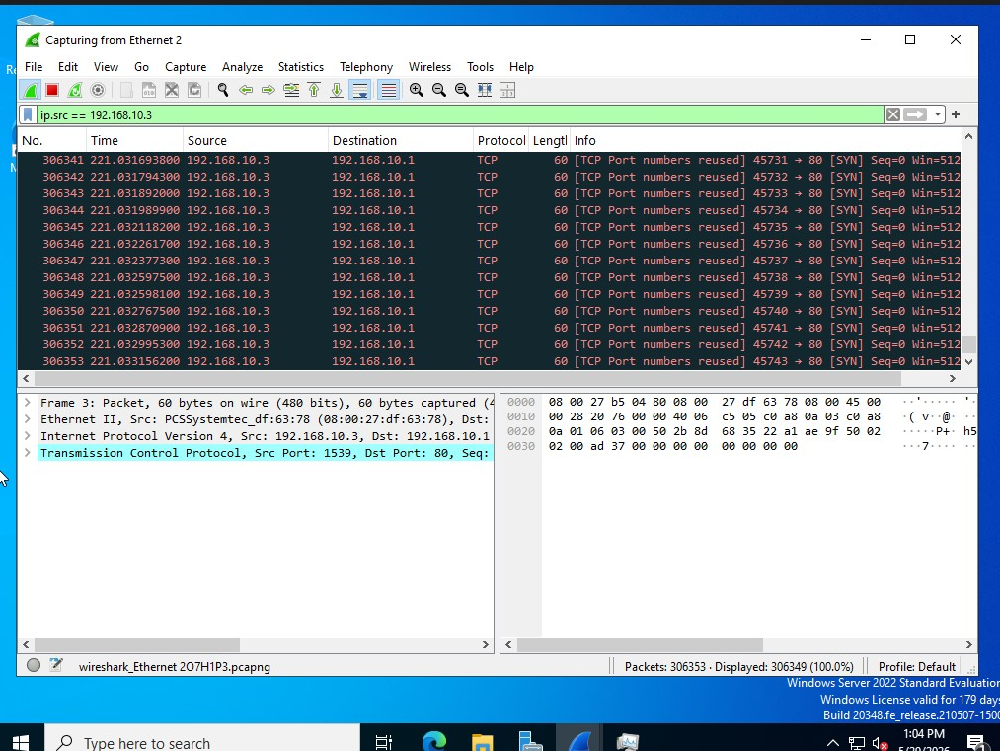
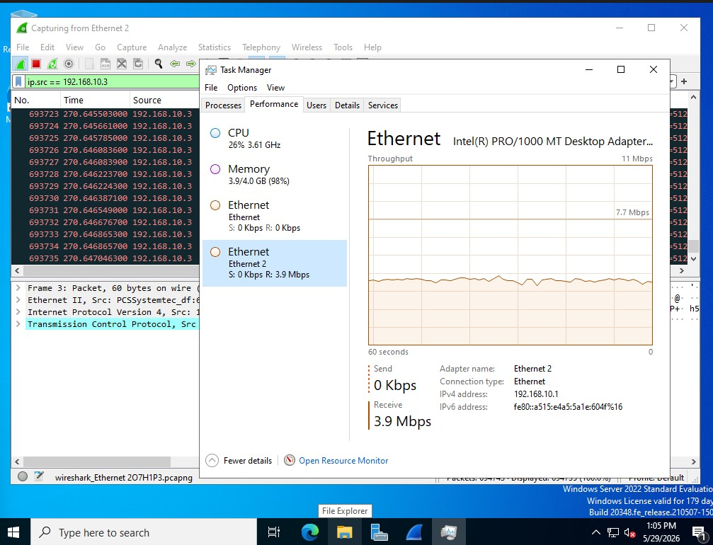

# DDoS Simulation — SYN Flood Attack

## Overview
Simulated a SYN Flood DDoS attack in an isolated 
virtual environment to observe network behavior 
and practice attack detection.

## Environment
- Attacker: Ubuntu Server (192.168.10.3)
- Target: Windows Server 2022 (192.168.10.1)
- Tool: hping3
- Detection: Wireshark

## Attack Details
- Attack type: SYN Flood
- Target port: 80
- Tool used: hping3

## Command Used

```
sudo hping3 -S --flood -V -p 80 192.168.10.1
```

## What Was Observed
- Massive increase in network traffic on target
- Wireshark showed flood of SYN packets 
  from attacker IP
- Windows Server CPU and network usage spiked
  during attack

## What I Learned
- How SYN Flood attacks work in practice
- How to detect DDoS traffic using Wireshark
- Difference between normal and malicious traffic
- Importance of network monitoring in NOC/SOC

## Screenshots


*SYN Flood attack running on Ubuntu Server using hping3*


*Wireshark showing flood of SYN packets from attacker 192.168.10.3*


*Windows Server network and CPU usage spike during DDoS attack*
