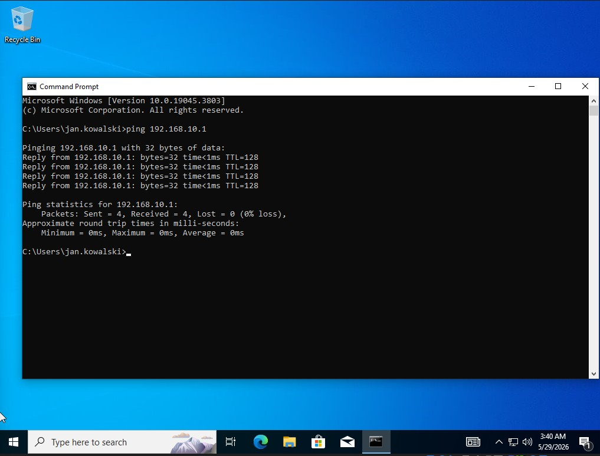
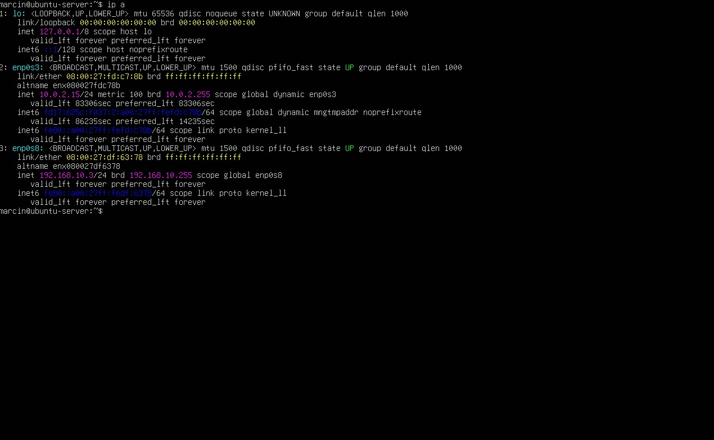
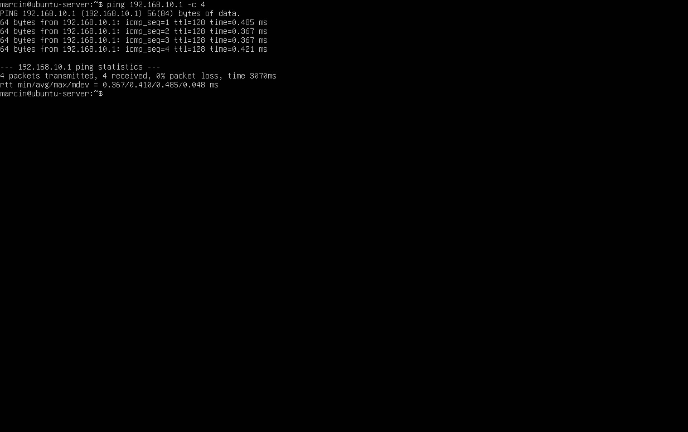

# Network Configuration

## Overview
Configured internal network between virtual machines
using VirtualBox Internal Network.

## Network Topology
| Machine          | IP Address     | Role              |
|-----------------|----------------|-------------------|
| Windows Server  | 192.168.10.1   | Domain Controller |
| Windows 10      | 192.168.10.2   | Domain Client     |
| Ubuntu Server   | 192.168.10.3   | Linux Server      |

## Configuration
- Internal Network name: homelab
- Subnet: 192.168.10.0/24
- All machines connected via NAT (internet) 
  and Internal Network (homelab)

## Connectivity Tests
- Windows Server ↔ Windows 10: ✅
- Windows Server ↔ Ubuntu: ✅
- Windows 10 ↔ Ubuntu: ✅
  
## Real-World Relevance
Network segmentation using VLANs and static IP addressing
mirrors enterprise network design. Understanding IP routing
and subnet configuration is fundamental for everyday role and job of It personale.

## Screenshots

*Successful ping from Windows 10 to Domain Controller*

*Ubuntu Server network interfaces — NAT and static IP configured*

*Successful ping from Ubuntu Server to Domain Controller*
