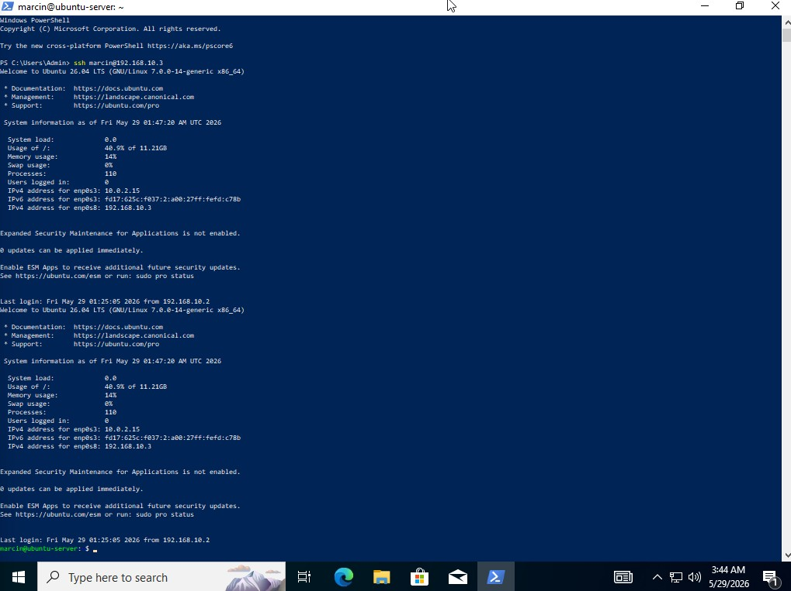
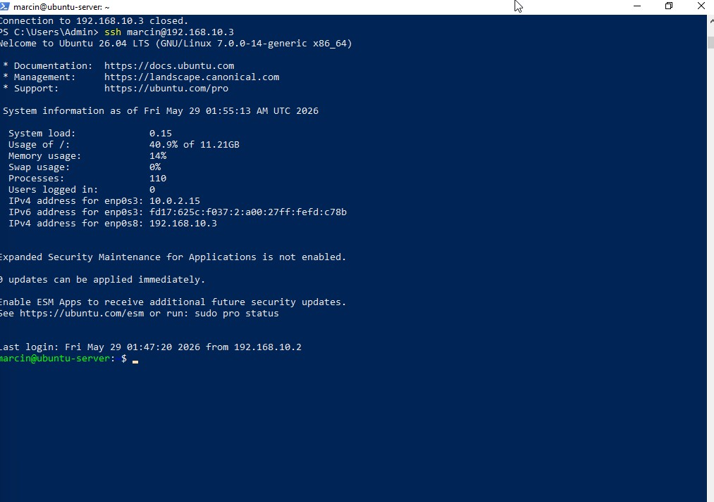

# SSH Configuration & Key Authentication

## Overview
Configured SSH key-based authentication between
Windows 10 and Ubuntu Server eliminating 
password-based login.

## Environment
- SSH Client: Windows 10 (PowerShell)
- SSH Server: Ubuntu Server (192.168.10.3)

## Steps Performed
1. Generated RSA 4096-bit key pair on Windows 10
   ssh-keygen -t rsa -b 4096

2. Created .ssh directory on Ubuntu Server
   mkdir -p ~/.ssh
   chmod 700 ~/.ssh

3. Copied public key to Ubuntu Server
   authorized_keys file

4. Verified passwordless login
   ssh marcin@192.168.10.3

## Result
- Passwordless SSH authentication working ✅
- RSA 4096-bit encryption ✅
- Public key authentication ✅

## Real-World Relevance
SSH key authentication is the industry standard for
secure remote access in enterprise environments.
Password-based SSH is considered insecure in production —
key-based auth eliminates brute-force attack vectors.

## Screenshots

*SSH connection initiated from Windows 10 PowerShell*

*RSA key pair and authorized_keys file on Ubuntu Server*

*Passwordless SSH authentication — logged into Ubuntu without password*
