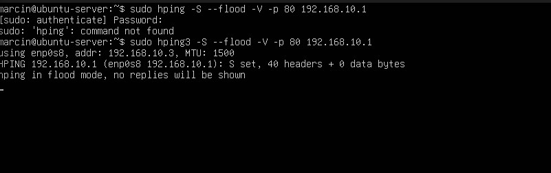
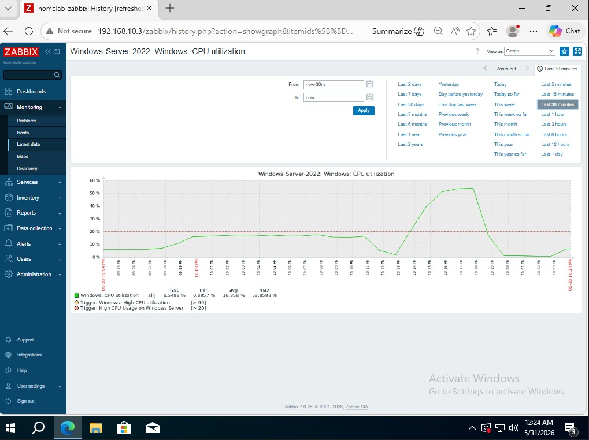
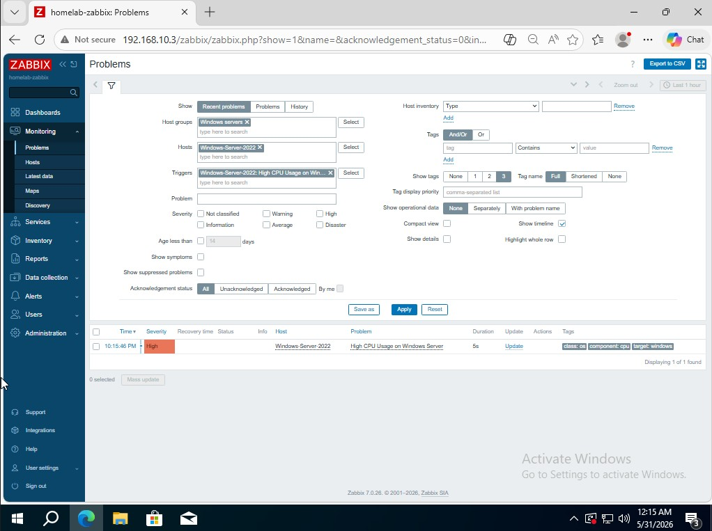
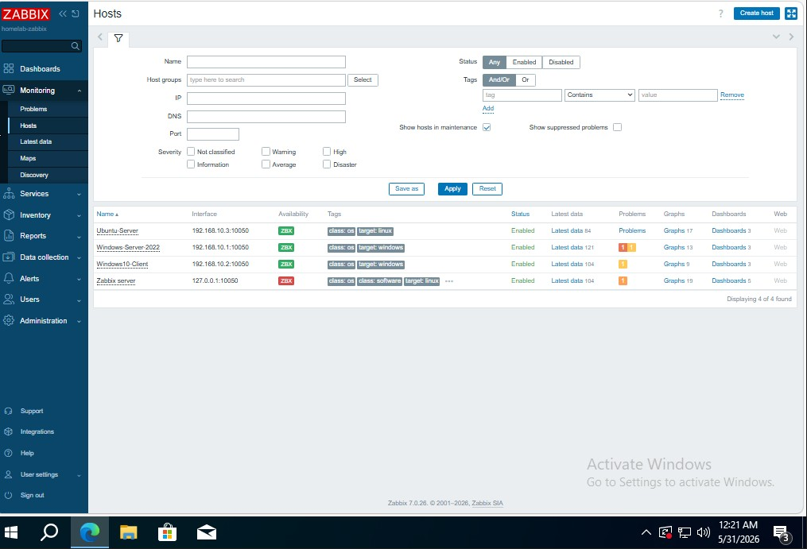
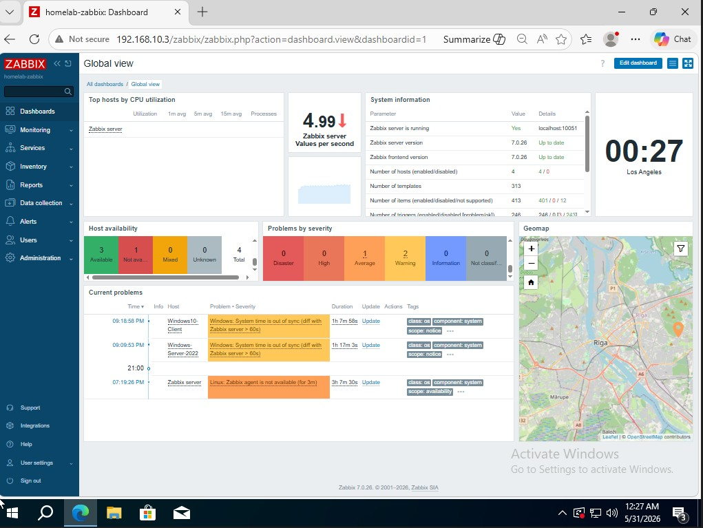
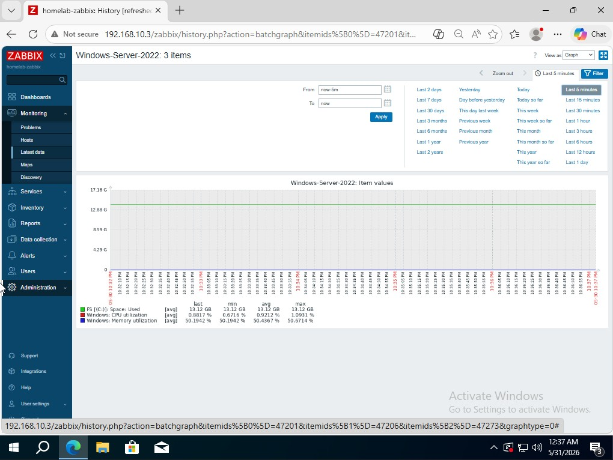

# Zabbix Monitoring — Home Lab

## Overview
Deployed Zabbix 7.0 monitoring server on Ubuntu to monitor
all virtual machines in the home lab environment.

## Environment
| Host | IP | OS | Status |
|------|----|----|--------|
| Zabbix Server | 192.168.10.3 | Ubuntu Server | ✅ |
| Windows-Server-2022 | 192.168.10.1 | Windows Server 2022 | ✅ |
| Windows10-Client | 192.168.10.2 | Windows 10 Pro | ✅ |

## What Was Configured

### Zabbix Server
- Installed Zabbix 7.0 on Ubuntu Server 24.04
- Configured PostgreSQL database backend
- Set up Apache web frontend

### Monitoring Agents
- Deployed Zabbix Agent on Windows Server 2022
- Deployed Zabbix Agent on Windows 10 Pro
- Deployed Zabbix Agent on Ubuntu Server
- Configured firewall rules to allow port 10050

### Monitored Metrics
- CPU utilization (all hosts)
- Memory utilization (all hosts)
- Disk space usage (all hosts)
- Network traffic (all hosts)
- Windows services status

### Alerts & Triggers
- Trigger: High CPU Usage (threshold > 20%)
- Severity: High
- Automatic alert generation on threshold breach

### DDoS Detection Test
- Launched SYN Flood attack using hping3 from Ubuntu
- Target: Windows Server 2022 (192.168.10.1)
- Observed real-time CPU spike in Zabbix graphs
- Trigger fired automatically when CPU exceeded threshold
- Correlated network attack with system performance metrics

## DDoS Detection Test
Simulated SYN Flood attack using hping3 from Ubuntu
and observed real-time CPU spike detection in Zabbix.
Trigger fired automatically when threshold was exceeded.

## What I Learned
- How to deploy and configure Zabbix monitoring server
- How to add hosts and configure agents
- How to create triggers and alerts
- How NOC monitors infrastructure in real time
- How to correlate attack traffic with system metrics

## Real-World Relevance
This lab simulates a core NOC workflow:

1. Infrastructure monitoring — 3 hosts reporting
   metrics to central Zabbix server, mirroring
   real enterprise monitoring environments

2. Incident detection — custom trigger detected
   abnormal CPU behavior automatically, without
   manual intervention

3. Attack correlation — SYN Flood attack visible
   in both network traffic and CPU metrics,
   demonstrating how NOC/SOC analysts correlate
   events from multiple data sources

4. Alert response — trigger fired with High severity,
   demonstrating automated alerting pipeline
   used in real SOC environments

## Screenshots

*SYN Flood attack running on Ubuntu using hping3*

*Zabbix graph showing CPU spike during DDoS simulation*

*Zabbix trigger fired — High CPU Usage alert*

*All 3 hosts monitored with green ZBX availability*

*Main Zabbix dashboard — homelab-zabbix*

*Windows Server 2022 — RAM, CPU and disk utilization*
